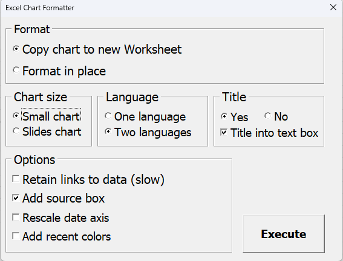
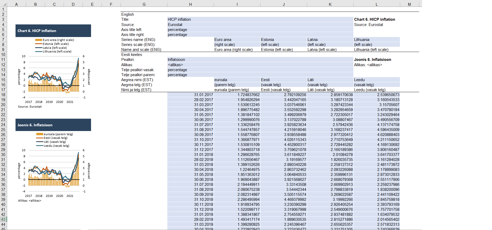

# Excel VBA Chart Formatter
The VBA code in this repository makes Excel charts pretty. Formatted charts are suitable for publications and presentations.

Preparing Excel charts for regular publications and presentations is a tedious and time consuming task. Excel spreadsheets may contain raw data and calculations which would be irrelevat to other colleaques and editors. The purpose of VBA code in this repository is to automate the routine editorial process. The program copies the data of an arbitrary Excel chart to a new spreadsheet and applies formatting procedures. One may choose to create two copies of the underlying Excel chart for multiple language purposes. There is also an option to decide between two chart sizes: the small one and the large one suitable for Power-Point presentations. Additionally, the user may opt to plot the chart title inside of a text box, have a standard Excel chart title or proceed without a title.

Please note that the application is designed to prettify simple chart types like line charts and column charts. This program may fail in case of complex chart types like pies, radars, scatter plots etc.        

## Usage
* Activate the Excel chart that shall to be prettified (click once on surface of the chart area) 
* Click on 'Format chart' menu button on 'Add-ins' menubar of an Excel spreadsheet

* Accept all messages on trust settings that may appear  
* This will open up an user form. You may apply the desired properties of formatting

* Press 'Execute' button to start formatting
* A new spreadsheet with formatted copy (or two copies) of the chart will be created 
* The data of the underlying chart will also be available on the new spreadsheet

## Installation 
* Dowload the Excel add-in from this github repository     
* Open an Excel spreadsheet 
* Double click on ChartFormatter.xlam file in the "Install" folder  

## Technical info  
* VBA code is packed into a .xlam file
* Principles of object-oriented programming were applied by using VBA classes, types, collections etc.   
* The program has been tested on Excel 2016 Professional Plus version  
* Read the license requirements (GPLV3) before modifying the source code
